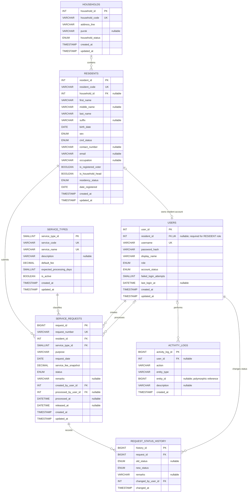

# Diagrams

## Updated Entity-Relationship Diagram

This ERD is generated from the current MySQL schema in
`src/main/resources/db/01_schema.sql`. The editable Mermaid source is
[`barangayconnect-erd.mmd`](barangayconnect-erd.mmd).

### Relationship notes

- A resident may belong to one household; a household may contain many
  residents.
- A resident may have at most one user account. `users.resident_id` is nullable
  and unique: it is required for `RESIDENT` users and must be null for `STAFF`
  and `ADMIN` users.
- Every service request belongs to one resident and one service type.
- Every service request has one creator and may have one processor.
- A service request may have many status-history entries.
- Activity logs may remain after their associated user is removed because
  `activity_logs.user_id` is nullable and uses `ON DELETE SET NULL`.
- `activity_logs.entity_id` is a polymorphic application reference, not a
  database foreign key.

The `vw_service_request_summary` reporting view is intentionally not modeled as
an entity because it derives data from `service_requests`, `residents`,
`service_types`, and `users`.
